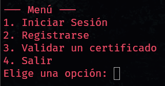

# PIA Criptografía

Este es el Producto Integrador de Aprendizaje para la materia de Criptografía.
Es un programa de CLI creado en python, puedes crear llaves publicas/privadas
utilizando un algoritmo de curvas elípticas, la llave privada es encriptada con
una contraseña proporcionada por el usuario. Puedes firmar archivos, esto crea un
_.cer_, ademas de poder verificarlo.

[ ✅ ] 1. Iniciar preguntando si quiere registrarse o iniciar sesión.  
[ ✅ ] 2. El certificado debe guardarse como dos archivos, la llave
        privada debe estar cifrada por contraseña.  
[ ✅ ] 3. Se deberá poder guardar información cifrada con los certificados del
        usuario.  
[ ✅ ] 4. Se utilizará un sistema blockchain o de curvas elípticas para la
        generación de llaves.  
[ ✅ ] 5. Cuenta por lo menos con 3 sistemas criptográficos: simétrico, asimétrico
      y otro libre.

## Instalación

Siguiendo estos comandos, se clonara el repositorio del proyecto, python creada
un espacio virtual para poder instalar los paquetes dentro de este.

**Requisitos:**

- click==8.1.3
- cryptography==40.0.2

```bash
git clone https://github.com/SayagoDev/pia-cripto.git
cd pia-cripto
python -m venv env
source env/bin/activate
pip install -r requirements.txt
```

## Cómo usar

### Básica

Para ejecutarlo solo debes utilizar el siguiente comando:

```bash
python pia.py
```

Esto desplegara un menú, con las diferentes opciones:

 

### Funciones separadas

También es posible solo utilizar las funcionalidades necesario. Ya sea «iniciar
sesión», «registrarse» o «validar un certificado» *(la opción de firmar un
documento se desbloquea cuando **inicias sesión**)*.

```bash
# Para solo inicar sesión 
$ python pia.py login

# Para solo registrarse
$ python pia.py register

# Para solo verificar un certificado
$ python pia.py verificar_signature
```

### Funciones separadas con parámetros

Normalmente al ejecutar una función por separado sin parámetros, se pedirán al
usuario. Pero esto puede ser evitado al enviarlos a través de parámetros usando
_flags_. Para ver las _flags_ de cada comando solamente debes pasar el parámetro
`--help`.

**Ejemplo:**

```bash
$ python pia.py verificar_signature --help
Usage: pia.py verificar-signature [OPTIONS]

  Función para verificar un certificado '.cer'

Options:
  -k, --public_key TEXT
  -p, --file_path TEXT
  -c, --certificado TEXT
  --help                  Show this message and exit.
```

Entonces, para verificar un supuesto archivo _hello.txt_, con certificado
_hello.cer_ y llave publica: _sayago_pub.pem_.

`$ python pia.py verificar_signature -k sayago_pub.pem -p hello.txt -c hello.cer`

Algo parecido se pueda hacer para las demás funcionalidades.
